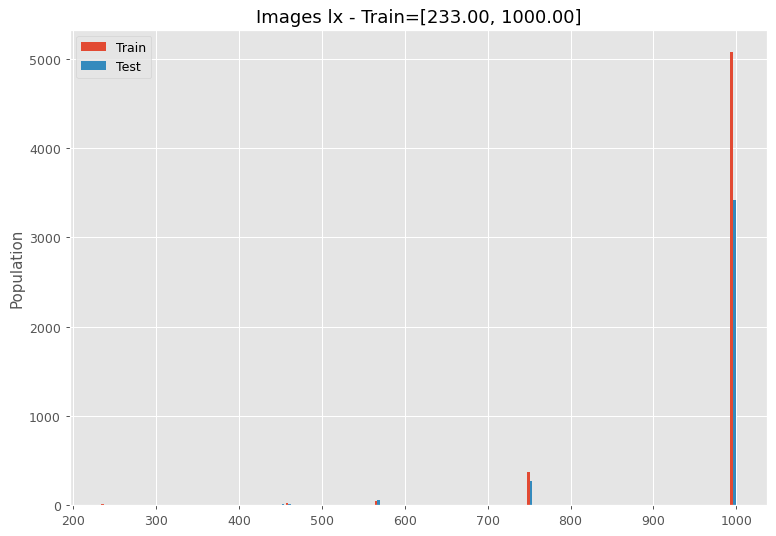

# DataTalksClub Kitchenware Classification Competition

Using convolution neural network (cnn) with data augmentation techniques and transfer learning to classifiy kitchenware images to 6 classes:
 - cups
 - glasses
 - plates
 - spoons
 - forks
 - knives

 # Dataset

This project uses a dataset with more than `9300` images.

# Overview
This dataset contains images of different kitchenware.

### Files

* `train.csv` - the training set (Image IDs and classes)
* `test.csv` - the test set (Just image IDs)
* `sample_submission.csv` - a sample submission file in the correct format
* `images/` - the images in the JPEG format

# Contents of the folder 

# Exploratory Data Analysis
See the [Kitchenware_EDA.ipynb](./notebooks/Kitchenware_EDA.ipynb) for this task.

### Image sizes statistics

The images have various and varied sizes, ranging from 39 Kilopixels to 976 Kilopixels, also more than half of the images are concentrated at 750 Kpixels. This is bad news since the tensors must imperatively have the same size.

### The width to heigth ratio (lx/ly)

Most images are vertical.

### By width (lx)

The width varies from 233 to 1000, and it is concentrated on 1000.
### By heigth (ly)

The heigth varies from 174 to 1000, and it is concentrated on 750.
### Labels statistics

Not all labels are representend equaly.

# Models
| Model | Data Augmentation | Transfer Learning | Epochs | Losss | Accuracy % |
|:---|:---|:---|:---|:---|:---|
|model 1|✖️|✖️|25|0.8718|67.0266|
|model 2|✖️|✖️|10|1.0553|66.7387|
|model 3|✖️|✖️|10|0.7926|71.7063|
|model 4|✔️|✖️|25|0.7995|68.8265|
|model 5|✔️|vgg16 ✔️|25|0.7966|92.1526|
|model 6|✔️|vgg 16 ✔️|10|✖️|✖️|
|model 7|✔️|vgg 16 ✔️|10|0.4065|91.3607|
|model 8|✔️|efficientnet0 ✔️|10|0.4896|91.2887|
|model 9|✔️|efficientnet0 ✔️|10|0.4793|90.9287|
|model 10|✔️|efficientnetB7 ✔️|10|0.2978|92.0806|
|model 10 bis|✔️|efficientnetB7 ✔️|10|0.2990|93.5925|
|model 11|✔️|efficientnetB7 ✔️|20|0.2830|93.9525|
|model 12|✔️|efficientnetB7 ✔️|25|0.2534|93.6645|
|model 13|✔️|resnet50 ✔️|10|1.5776|39.7408|

I tried a multitude of models first, without data augmentation or transfer learning, it had a bad impact and I couldn't exceed an accuracy of 72%. Then, thanks to data augmentation and transfer learning, I was able to increase accuracy. the best accuracy was obtained with model 12 with a lost function which dropped to **0.2534** thanks to transfer learning via the base model `EfficientNetB7` as shown in the graph below.

We see that the test loss continues to drop, while the test accuracy continues to increase. I stopped at 25 epochs but I think the model can give better results by increasing the number of epochs, especially since the overfitting is minimal.  
**Note**:
The ResNet50 was the wrong model.
# Deployment of model

# Virtual Environment/venv

# Test the project

# Want to Contribute?
* Fork 🍴 the repository and send PRs.
* Do ⭐ this repository if you like the content.

**Connect with me:**

  
  
  
  

